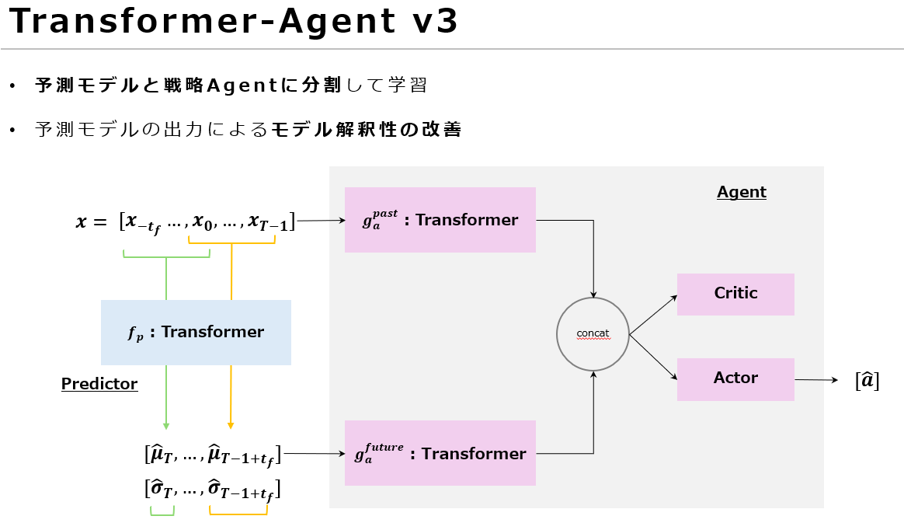

# TransformerAgentV3

## 概要
v2では, 少し先の未来について考えることでノイズの影響を軽減した.    
また, v2では直接action確率を出力させていた.  
しかし, この方法ではモデルの学習が困難になると考えられる.  
なぜなら, モデルが学習しなければならないのは, 未来の値の予測と, 未来に対するactionの戦略の2つである.

v2では, 目的関数として設定されているのは, actionの確率だけ.  
しかし, そのactionを決めるためには必然的に, 未来の予測が必要になると考えれる.  
そのため, モデルは暗黙的に未来を予測するような特徴を掴んでいると思われる.  

そこで, v3では未来の値を予測するモデルと, 戦略を決めるモデルを分離する.  
これによって, モデルあたりの負荷が軽減され, 学習が安定すると考えられる.  
さらに, 予測モデルによって, 未来の値が可視化されるため, 戦略モデルによる決定についての解釈性が向上する.  

## モデル
モデルのアーキテクチャを以下に示す.  
学習は2段階で行う.  
1. 予測モデルの学習
2. 戦略モデルの学習  
   このとき, 予測モデルは凍結する.  

## issue
- [x] 予測モデルの作成
- [x] 予測モデル用学習データの作成
- [ ] 予測trainスクリプトの作成
- [ ] 予測trainスクリプトの実行
- [ ] 戦略モデルの作成
- [ ] rewardの再設計 (未来の日数で正規化したい)
- [ ] 戦略モデルtrainスクリプトの作成 (ほぼ使い回しで良い)
- [ ] 戦略モデルtrainスクリプトの実行

